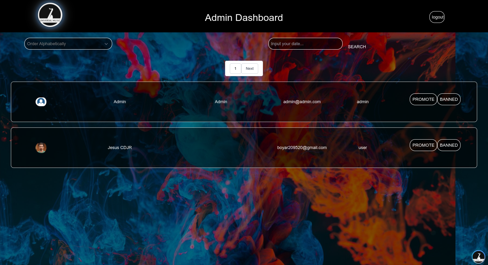

                                                                                                                
<h1 align="center">
Me llamo Ciro Rey :wave:
</h1>
<h3 align="center"> Full Stack Developer :computer: </h3>
Soy programador full stack con orientación al back-end, puedo realizar proyectos manejando un código limpio y con buenas prácticas haciendo que me sea fácil el trabajo en equipo. 
Me gusta aprender nuevas tecnologías y aplicarlas en proyectos en los que pueda innovar y plasmar mis ideas
                
----
<h3 align="center">Proyectos :purple_heart: </h3>

<tr>
<td>

</td>
<td> <h4 align="left"><code>Universal Music - Ecommerce.</code> </h4>
  

    
ver más...

  
  
Proyecto en grupo realizado para el Bootcamp Henry, esta aplicacion permite ver productos musicales de alta calidad, donde el usuario podra filtrar productos por calificacion, precio y categorias, el usuario tendra la posibilidad de agregar productos a un carrito donde solo podra realizar el pago atravez de Stripe si se registra con un correo o bien con un usuario de google. Ademas cuenta con un panel de administracion el cual permite al admin listar todos los productos, eliminar, editar y crear otros. Tambien podra ver todas las ordenes de compra que se hicieron, confirmarlas o cancelar.

  
Link del repo Api: <a href="https://github.com/cirorey20/api-pf-ecommerce">uv-api </a>

  
Link del repo Client: <a href="https://github.com/cirorey20/client-pf-ecommerce"> uv-client </a>

    
Link Web: <a href="https://universalmusic-henry.web.app/"> web-universalmusic.app </a>

  

   

     
     
     
     
     
     
     
     
     
  

 

 #### Desarrollada

- React
- Tailwindcss
- Redux
- Typescript
- NodeJs
- Express
- Sequelize
- Auth0

  
 </td>
</tr>
<!-- <tr> -->
<!-- <td> -->

<tr>
<td>

</td>
<td> <h4 align="left"> <code>Videogames App.</code> </h4>
  

    
ver más...

   
  
Desarrollo de una SPA (Single-Page Application), usando ReactJS para el Front-End, y Redux para gestionar el estado de la aplicación, los componentes fueron desarrollados con CSS, sin el uso de librerías externas. La aplicación  de Videogames permite ordenar y filtrar los datos traídos de una API, y de una base de datos local, también permite crear videogames propios, y mostrar el detalle los mismos.. 

  
Link del repo Api: <a href="https://github.com/cirorey20/api-rest-videogames">videogames-api </a>

  
Link del repo Client: <a href="https://github.com/cirorey20/client-videogames"> videogames-client </a>

    
Link Web: <a href="https://videogamesciroapp.web.app/"> web-videogames.app </a>

  

   

     
     
     
     
     
  

 

#### Desarrollada

- React
- Redux
- NodeJs
- Express
- Sequelize
- Passport

  
 </td>
  
</tr>

----

### Contacto

- Email: cirorey95@gmail.com
- [Ciro Rey](https://www.linkedin.com/in/cirorey/ "Enlace a mi perfil de Linkedin") en Linkedin
